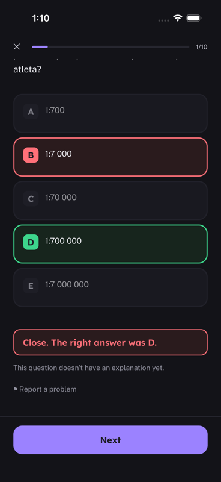
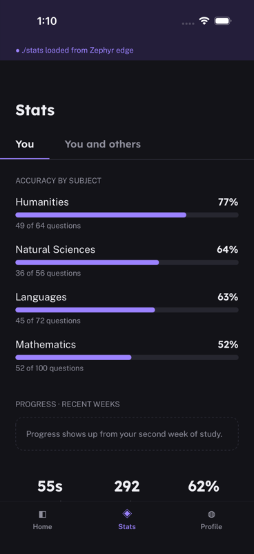
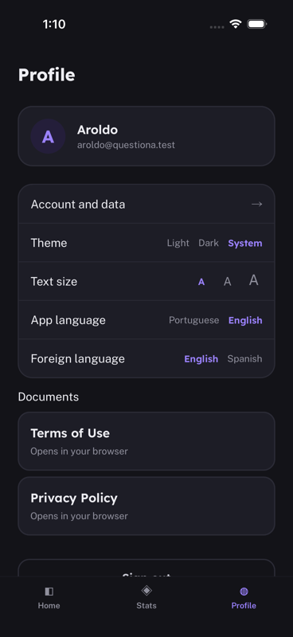
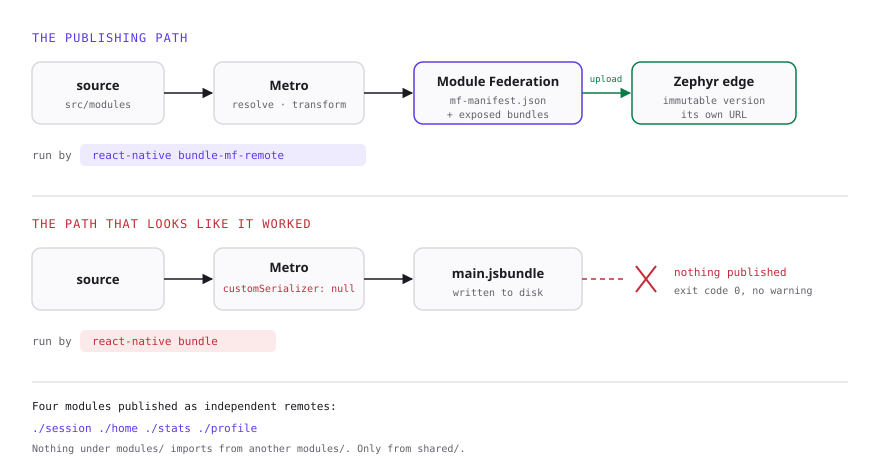

# Questiona

A React Native app built to learn how **Zephyr Cloud** works with the Metro
bundler: what it actually does, where it sits relative to Metro, and what the
day-to-day looks like once it is wired in.

The app itself is a study tool for the ENEM, Brazil's national university
entrance exam. It shows one question at a time, marks it right or wrong on the
spot, and compares your accuracy against everyone else's. Real content made the
integration worth testing: 2,700 questions with images, foreign-language
variants and long supporting texts stress the bundler in ways a to-do list never
would.

<p align="center">
  
</p>

<p align="center">
  
  
  
  
</p>

## Where to start

| Looking for | It is here |
|---|---|
| How Zephyr fits the RN build pipeline | [Where Zephyr sits](#where-zephyr-sits), below |
| How I would use it on a real project | [that section](#how-i-would-use-it-on-a-real-project) |
| Developer experience and docs feedback | [`docs/zephyr.md`](docs/zephyr.md) — seven rough edges, each with the evidence, and eight suggestions |
| Proof the deploy works | [`docs/validating-federation.md`](docs/validating-federation.md) — five checks you can run yourself |
| The app consuming a published remote | [`src/shared/federation/`](src/shared/federation/), and §6 of the write-up |

## Where Zephyr sits

Zephyr does not replace Metro. Metro still resolves the imports, runs the Babel
transforms and produces the bundle. Zephyr hooks onto the end of that: it takes
the output, versions it immutably, pushes it to the edge and hands back a URL
for that exact version.

<picture>
  <source media="(prefers-color-scheme: dark)" srcset="docs/media/architecture-dark.svg">
  
</picture>

Two pieces make it work, and both are required:

```js
// metro.config.js
const zephyrConfig = await withZephyr({ name: 'Questiona', target: 'ios' })(baseConfig)
return withModuleFederation(zephyrConfig, mfConfig, { flags: { /* ... */ } })
```

```js
// react-native.config.js — this is the part that actually publishes
const wrapped = zephyrCommandWrapper(
  commands.bundleMFRemoteCommand.func,
  commands.loadMetroConfig,
  () => updateManifest(global.__METRO_FEDERATION_MANIFEST_PATH, global.__METRO_FEDERATION_CONFIG),
)
```

```bash
npm run deploy:ios     # react-native bundle-mf-remote --platform ios --dev false
```

> A plain `react-native bundle` publishes **nothing**, even with `withZephyr` in
> the config. It authenticates, greets you by name, bumps the version counter,
> writes the bundle and exits with code 0. The cause, and four other rough
> edges, are in [`docs/zephyr.md`](docs/zephyr.md).

### Why this matters on a native app

Fixing a bug on mobile normally means build, submit, wait for review, wait for
adoption: days. The JavaScript bundle is a downloadable file, so Zephyr lets you
swap the JS version without going through the store, within Apple's and Google's
rule that only JS changes and never the native binary.

### How I would use it on a real project

**Preview per branch.** Every pull request produces a version with its own URL.
QA and product open the app pointed at that version, with no TestFlight round
trip and no native build.

**JS rollback in minutes.** A production bug that lives in the JS stops being a
hotfix submitted to the store and becomes pointing the environment back at the
previous version.

**Module Federation, once there are teams.** Each domain becomes a remote with
its own deploy, and Zephyr resolves which version of each remote the host loads
per environment. This app already publishes four:

| Remote | Domain |
|---|---|
| `./session` | answering and grading, the core |
| `./home` | entry point, continue where you left off |
| `./stats` | your accuracy against the population average |
| `./profile` | account, preferences, data export and deletion |

And it consumes one: the stats tab renders `./stats` fetched from the edge, with
a banner naming where the screen came from. Change the screen, deploy, revert the
file, reload — the change is there, with no rebuild. Getting that working meant
going around the plugin's host runtime, which does not survive React Native
0.87's boot order; the workaround and the six failures behind it are in
[docs/zephyr.md](docs/zephyr.md) §6.

With one person working on it, that split is discipline rather than savings:
everything ships together anyway. What makes it pay off is the import rule, not
the deploy mechanics. Nothing under `modules/` imports from another `modules/`,
only from `shared/`. That is what turns federation into a mechanical step later
instead of a refactor.

What I would **not** use it for: replacing native versioning. The binary still
follows the store cycle, and anything touching native code is not an OTA update.

## Running it

```bash
npm install
cd ios && pod install && cd ..
npm start          # Metro
npm run ios        # or npm run android
```

### About the backend

The app reads questions from an API that lives in a separate repository. It is
**not needed** to evaluate the Zephyr integration: `metro.config.js`,
`react-native.config.js` and the publishing flow are independent of it.

With no API running, the app opens and shows the connection-failure screen with
a retry button. That is the intended behaviour, and the `sem-api.yaml` E2E flow
asserts it.

The address lives in `src/shared/api/client.ts`. On the Android emulator the
host resolves to `10.0.2.2`, the alias for the machine running the emulator.

## Deploying

```bash
npm run deploy:ios       # or deploy:android
```

Published as `questiona.questiona.questoes` (app.project.org). Two things decide
those three names:

- A git repository with a **remote origin** is mandatory. Zephyr reads the
  organization and project from it.
- `zephyr.config.js` overrides what the git remote implies. Without it the app
  lands under the GitHub account that owns the repository instead of the
  product's own organization, and the dashboard shows an empty project list
  while builds succeed somewhere else.

## Project layout

```
src/
  modules/questions/      session, results, subject picker
  modules/stats/          charts and the population comparison
  modules/account/        onboarding, profile, data export and deletion
  shared/ui-kit/          design tokens and primitives (Screen, Card, Button)
  shared/rich-text/       question markdown: pure parser + rendering
  shared/preferences/     theme, text scale, languages + v1.0 migration
  shared/api/             HTTP client
  shared/auth/            session, persisted and refreshed
  shared/i18n/            interface strings, Portuguese and English
```

[`CONTEXT.md`](CONTEXT.md) names the domain concepts and lists the values that
became a contract with installed devices and cannot be renamed freely.

Design tokens (colors, type scale, spacing) come from a design document and
reach the screens through a single `useTema()` hook, so the theme and text-size
settings in the profile apply everywhere instead of only where someone
remembered to wire them.

## Tests

```bash
npm test              # 33 unit tests
npm run e2e           # 6 Maestro flows on the simulator
npm run e2e:offline   # the offline flow, with the API stopped
```

The E2E flows cover onboarding with the consent checkbox, the answering loop, a
full ten-question session, problem reporting, the preference switches and the
offline state. They caught three real bugs during development, including a
keyboard covering the sign-up button and a race where the home screen loaded
before the answers finished syncing.

## Notes on the integration

[`docs/zephyr.md`](docs/zephyr.md) has the full write-up: what worked, seven
rough edges with the evidence behind each, and the suggestions I would send to
the Zephyr team.

The short version: the integration is genuinely small once you are on the right
path. Finding the right path took considerably longer than wiring it up.
